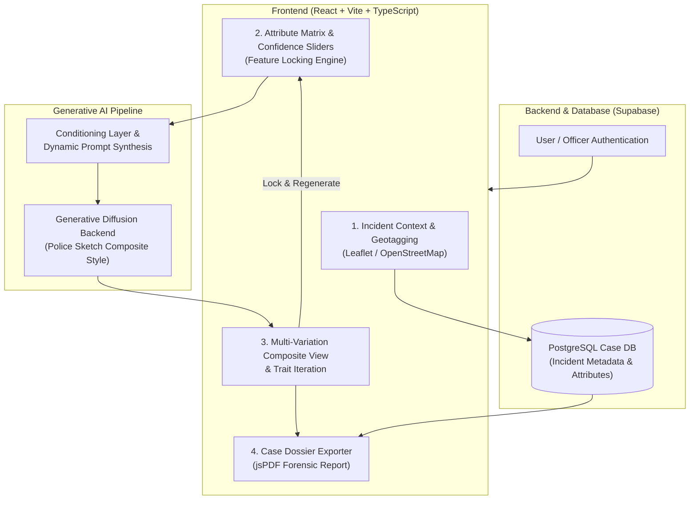

# 🕵️‍♂️ SUIGEN: AI-Powered Suspect Image Generator

<div align="center">

**Forensic Facial Composite Generation Platform for Law Enforcement & Investigative Intelligence**

[](https://www.my-app.works/)
[](https://youtu.be/Uz1TAGH7DaI)
[](#-awards--recognition)
[](LICENSE)

<br/>

[](https://react.dev/)
[](https://www.typescriptlang.org/)
[](https://vitejs.dev/)
[](https://tailwindcss.com/)
[](https://supabase.com/)
[](https://leafletjs.com/)

<p align="center">
  <a href="#-overview">Overview</a> •
  <a href="#-key-features">Key Features</a> •
  <a href="#-system-architecture">Architecture</a> •
  <a href="#-investigative-workflow">Workflow</a> •
  <a href="#-tech-stack">Tech Stack</a> •
  <a href="#-getting-started">Getting Started</a> •
  <a href="#-ethics--forensic-standards">Ethics</a> •
  <a href="#-author">Author</a>
</p>

</div>

---

## 🏆 Awards & Recognition
- 🥇 **3rd Prize Winner** at the **AROHAN 2.0 Student Project Exhibition**.

---

## 📖 Overview

**SUIGEN (Suspect Image Generator)** is an AI-assisted forensic facial reconstruction platform designed to transform eyewitness recall into precise, standardized police composite sketches within seconds.

### The Forensic Problem:
- **Scarcity of Forensic Artists:** Law enforcement agencies often lack immediate access to trained composite sketch artists.
- **Witness Memory Decay:** Psychological studies show eyewitness recall degrades rapidly with time. Extended multi-day interview delays introduce severe distortions.
- **Binary / Rigid Tools:** Existing software forces witnesses into rigid catalog picking without confidence nuance or iterative trait locking.

### The SUIGEN Solution:
SUIGEN bridges eyewitness memory and digital portrait synthesis through:
1. **Dynamic Confidence Weighting:** Allowing witnesses to specify certainty levels (Low, Medium, High) per trait.
2. **Selective Feature Locking:** Pinning confirmed anatomical features while iteratively regenerating uncertain ones.
3. **Geospatial & Temporal Context:** Capturing incident coordinates and timestamps alongside suspect metadata.
4. **Law Enforcement Dossier Export:** Producing case-stamped PDF reports ready for immediate field distribution.

---

## 🌟 Key Features

| Feature | Description |
| :--- | :--- |
| **🎛️ Granular Attribute Mapping** | Capture structured parameters for gender, age, ethnicity, height, face shape, eyes, hair, and distinctive marks. |
| **🔒 Trait Locking Engine** | Lock down confirmed features (e.g. eye color, jawline) to prevent them from mutating during successive generations. |
| **📊 Confidence Calibration Sliders** | Witness ratings (Low / Medium / High) dynamically calibrate prompt weights and AI adherence variance. |
| **🎨 Forensic Police Sketch Style** | Fine-tuned aesthetic pipeline delivering standardized charcoal/pencil forensic composite portraits with Case IDs. |
| **🗺️ Geospatial Scene Mapping** | Interactive OpenStreetMap/Leaflet integration to log exact crime coordinates and timestamps. |
| **📄 One-Click Case PDF Export** | Instant compilation of suspect image, incident metadata, and physical profile into an official case report. |
| **🔄 Multi-Perspective Variations** | Generates alternative facial perspectives and angle variations concurrently. |

---

## 🏗️ System Architecture



---

## 🔄 Investigative Workflow

1. **Log Incident Metadata & Geolocation:**
   The officer records incident timestamp and marks the exact crime scene coordinates on the interactive map.
2. **Configure Demographic & Anatomical Attributes:**
   The witness selects known traits (Age, Ethnicity, Height, Body Type, Head Shape, Facial Hair) and sets the **Confidence Slider** for each.
3. **Generate Initial Composites:**
   The AI synthesizes multiple composite variations adhering to standardized police sketch aesthetics.
4. **Lock & Iteratively Refine:**
   The witness locks accurately rendered traits (e.g. eyes and jawline) and commands the generator to vary the remaining features until likeness is achieved.
5. **Export Case File:**
   The system stamps the finalized sketch with a unique Case ID and generates a standardized, downloadable PDF report for field distribution.

---

## 🛠️ Tech Stack

- **Frontend:** [React 18](https://react.dev/), [TypeScript](https://www.typescriptlang.org/), [Vite](https://vitejs.dev/)
- **UI & Design:** [Tailwind CSS](https://tailwindcss.com/), [shadcn/ui](https://ui.shadcn.com/), [Lucide Icons](https://lucide.dev/)
- **Mapping & GIS:** [Leaflet](https://leafletjs.com/), [React-Leaflet](https://react-leaflet.js.org/), OpenStreetMap
- **Backend & Database:** [Supabase](https://supabase.com/) (PostgreSQL, Auth, Realtime)
- **Document Generation:** [jsPDF](https://github.com/parallax/jsPDF)
- **AI / Generative Stack:** Custom Diffusion Conditioning Pipeline with Weighted Prompt Engineering

---

## 🚀 Getting Started

### Prerequisites
- **Node.js** (v18.x or higher recommended)
- **npm** or **bun** / **yarn**

### Local Setup

1. **Clone the repository:**
   ```bash
   git clone https://github.com/naveensreekanth/SUIGEN-AI-Powered_Suspect_Image_Generator.git
   cd SUIGEN-AI-Powered_Suspect_Image_Generator
   ```

2. **Install dependencies:**
   ```bash
   npm install
   ```

3. **Configure Environment Variables:**
   Create a `.env` file in the project root:
   ```env
   VITE_SUPABASE_URL=your_supabase_project_url
   VITE_SUPABASE_ANON_KEY=your_supabase_anon_key
   ```

4. **Start the development server:**
   ```bash
   npm run dev
   ```
   Navigate to `http://localhost:8080` (or the port indicated in your terminal) to explore SUIGEN.

5. **Build for Production:**
   ```bash
   npm run build
   ```

---

## 🛡️ Ethics & Forensic Guidelines

- **Investigative Aid Only:** SUIGEN is designed as an investigative advisory system to generate leads and narrow suspect pools, not as sole legal evidence for identification.
- **Cognitive Bias Mitigation:** Confidence-calibrated prompts help prevent eyewitness overconfidence and reduce facial feature hallucination.
- **Security & Privacy:** Built with role-based authentication and secure database handling for sensitive incident data.

---

## 🗺️ Roadmap

- [x] Confidence-rated attribute sliders (Low / Medium / High)
- [x] Selective feature locking engine
- [x] Geospatial incident mapping (Leaflet / OpenStreetMap)
- [x] Automated Case ID & PDF dossier generation
- [ ] 3D facial mesh reconstruction from 2D composite
- [ ] Voice-to-attribute NLP witness interview transcription
- [ ] Automated CCTV / mugshot database similarity ranking

---

## 👤 Author & Maintainer

**Naveen Sreekanth**
- 🌐 **Live Website:** [my-app.works](https://www.my-app.works/)
- 🎥 **Video Demo:** [YouTube Walkthrough](https://youtu.be/Uz1TAGH7DaI)
- 🐙 **GitHub:** [@naveensreekanth](https://github.com/naveensreekanth)

---

## 📄 License

This project is licensed under the [MIT License](LICENSE).
